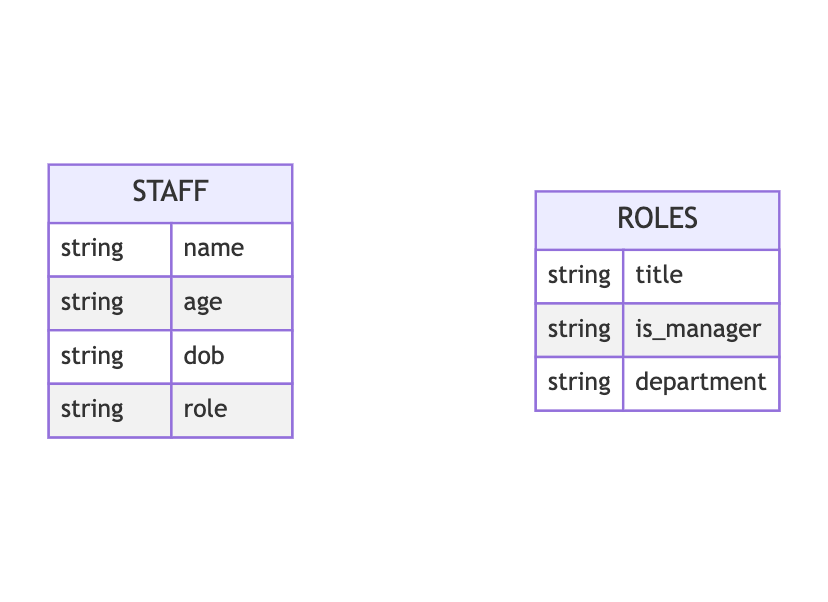

# Mermaid ERD Generator

General Purpose Tool for generating [Mermaid.js ERD Diagrams](https://mermaid-js.github.io/mermaid/#/./entityRelationshipDiagram)

## From CSVs
    
Add CSV files to `csvs` directory. Run `./main.py`. This should print a Mermaid ERD Diagram with Entities for each CSV file. CSV Header rows will be used to generate entitiy attributes. By default, all entity attributes will be `string` data types.

This diagram can be previewed using a Mermaid preview tool like [Mermaid Live](https://mermaid.live/edit#pako:eNpFj8EKwjAMhl-l5Lwn6E3QnQTBeSxIXLNZaNORpQcZe3crDHv7Avn-5N9gzJ7AAsk54CyYHA-PU9-bzawqgWfDmMjxMeDc2OfXnyVHMrvj--16GZqrQWMTwvpMyDVCWgYtKJqI9WdDB4kkYfD1o82xMQ70TfU-2IqeJixRHTje6yoWzcOHR7AqhTooi0elowbYCeNK-xdDclGN)

## TODOs

- [ ] make general purpose ERD block class for generating ERD subblock strings
  - IE `{ name: table_name, attributes: [(type, attribute_name),...], relationships: [??] }`
- [ ] make ERD diagram class 
  - IE `[sublock, ...]`
  - [ ] can generate diagram string
  - [ ] can generate SQL Schema statements
- [ ] use correct whitespacing
- [ ] figure out how to represent relationship data
- [ ] find ways to best guess data types of columns
- [ ] import from mermaid ERDiagram
- [ ] find ways to best guess relationships between entities
